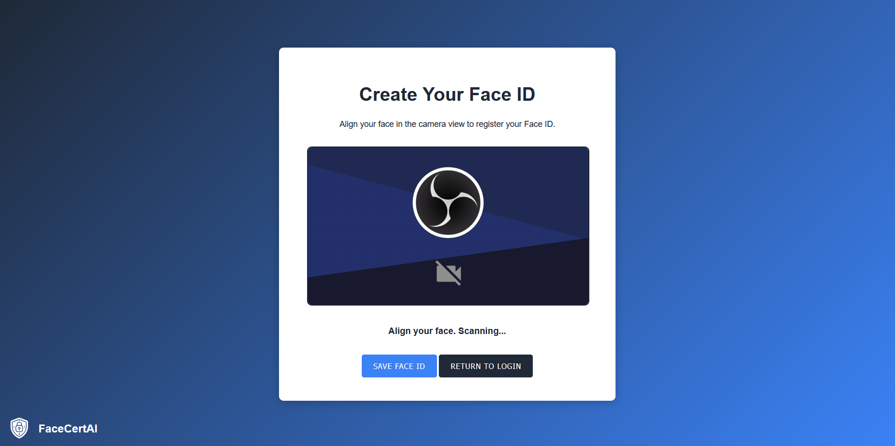

# FaceCert AI

FaceCert AI is a Java-based web application that leverages Spring Boot to implement AI-driven facial recognition for secure user authentication. The project emphasizes user privacy by ensuring all facial data is stored locally on the user's device.

## Installation

To set up and run FaceCert AI, follow these steps:

### Prerequisites
1. Install Java Development Kit (JDK) version 17 or higher.
2. Ensure you have a build tool like Gradle installed and configured.
3. Set up a Spring Boot development environment.

### Steps to Clone and Run

1. Clone the repository:
   ```bash
   git clone <repository-url>
   cd facecert-ai
   ```

2. Import the project into your preferred IDE or text editor.

3. Build and run the project:
    - Use Gradle to download dependencies and build the application:
      ```bash
      ./gradlew build
      ```
    - Run the application:
      ```bash
      ./gradlew bootRun
      ```

4. Access the application:
    - Open your browser and navigate to `http://localhost:8080`.

## Features

### Landing Page
- The landing page provides a user-friendly interface with two primary options: `Create Face ID` and `Sign In with Face ID`.
- Features a professional design with a logo and streamlined navigation.

### Create Face ID
Users can create a Face ID by aligning their face in the camera feed. The application uses `FaceAPI` to capture the face, extract its unique features, and securely store the face descriptor in the user's browser using IndexedDB.

#### Steps:
1. Navigate to the "Create Face ID" page.
2. Allow camera access.
3. Align your face in the camera feed, and the system will scan and save your Face ID.
4. Use the `Back` button to return to the home page after completing the process.

Screenshot:


### Sign In with Face ID
Users can authenticate themselves by aligning their face in the camera feed. The application matches the live face descriptor with previously stored descriptors using `FaceMatcher` for secure authentication.

#### Steps:
1. Navigate to the "Sign In with Face ID" page.
2. Align your face in the camera feed.
3. If a match is found, you will be redirected to a "Signed In" page.

Screenshot:


### Signed-In Page
After successful authentication, users are redirected to the "Signed In" page. This page displays a success message and provides a red `Sign Out` button for returning to the home page.

Screenshot:


## Usage

This project now includes the following functionality:

- **Create Face ID:** Users can register their face, which is securely stored in the browser's IndexedDB.
- **Sign In with Face ID:** Users can authenticate themselves using the previously saved Face ID.

### Key Features:
- **Spring Boot Integration:** Utilizes Spring Boot for seamless backend processing and routing.
- **FaceAPI:** Powers real-time facial recognition, landmark detection, and descriptor extraction.
- **IndexedDB Storage:** Ensures all facial data remains local to the user's browser for enhanced privacy.
- **Secure Matching:** Implements `FaceMatcher` for robust face descriptor comparison and authentication.
- **Improved User Interface:** Features responsive and visually appealing pages with consistent design across workflows.

## Changelog

#### v0.0.1 - Basic Setup
- Initial Spring Boot setup.
- Added placeholder HTML pages for "Create Face ID" and "Sign In".

#### v0.0.2 - IndexedDB Integration
- Implemented local data storage using IndexedDB.
- Added basic IndexedDB operations for saving and fetching data.

#### v0.0.3 - Camera Feed Integration
- Enabled camera access for live video feed.
- Added video feed to "Create Face ID" page.

#### v0.0.4 - Transition to Webcam Authentication
- Replaced image upload functionality with live face scanning via webcam.
- Updated "Create Face ID" page to capture frames from the video feed.

#### v0.0.5 - Error Handling Enhancements
- Added error messages for camera access issues.
- Improved error handling for IndexedDB operations.

#### v1.0.0 - Initial Release
- Basic Spring Boot setup.
- Placeholder functionality for "Create Face ID" and "Sign In with Face ID".

#### v1.1.0 - Enhanced Facial Recognition
- Integrated `FaceAPI` for facial detection, landmarks, and descriptor extraction.
- Local storage of face descriptors using IndexedDB.

#### v1.2.0 - Sign-In Implementation
- Added Face ID authentication using `FaceMatcher`.
- Improved error handling for face detection and data storage.
- Implemented retry functionality for failed sign-in attempts.

#### v1.3.0 - Finalized Workflow
- Validated face descriptor consistency between registration and authentication.
- Optimized UI for "Create Face ID" and "Sign In" workflows.
- Enhanced privacy by ensuring all data remains local.

#### v1.4.0 - Front-End Redesign and Finalization
- Updated UI with consistent, modern styling across all pages.
- Replaced pop-up messages with page redirects for smoother user experience.
- Added "Back" button to the "Create Face ID" page.
- Added "Signed In" page with a `Sign Out` button.
- Fixed minor bugs and improved user flow.

## License

[MIT](https://choosealicense.com/licenses/mit/)

